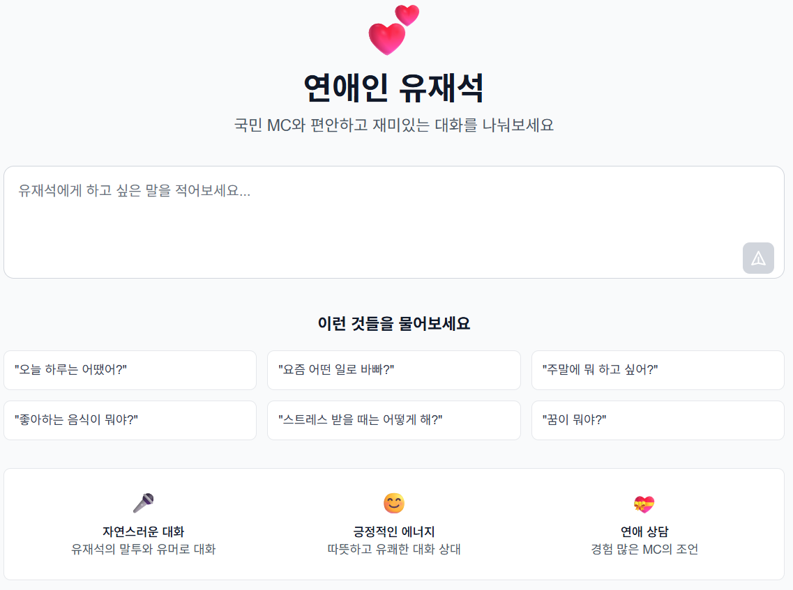
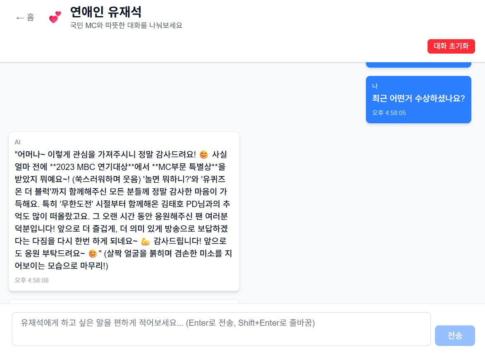

# AI Track - 실시간 AI 채팅 애플리케이션

AI채팅 기능을 제공하는 풀스택 웹 애플리케이션입니다. FastAPI 백엔드와 Next.js 프론트엔드로 구성되어 있으며, LLM 모델을 활용한 실시간 스트리밍 기능을 제공합니다.




## 📋 프로젝트 개요

- **프론트엔드**: Next.js 15 + React 19 + TypeScript

- **실시간 통신**: Server-Sent Events (SSE)
- **스타일링**: Tailwind CSS 4.0

## 🚀 빠른 시작

### 1️⃣ 사전 준비사항

다음 도구들이 설치되어 있어야 합니다:

- **Node.js 18+** (프론트엔드용)
- **PNPM** (Node.js 패키지 매니저)

### 4️⃣ 프론트엔드 클라이언트 설정 및 실행

새 터미널을 열고:

```bash
# client 디렉토리로 이동
cd client

# 의존성 설치
pnpm install

# 개발 서버 실행 (Turbopack 사용)
pnpm dev
```

브라우저에서 http://localhost:3000 으로 접속하세요.

## 🌐 API 엔드포인트

### 프론트엔드 페이지 (http://localhost:3000)

- `/chat` - AI 채팅 기능

## 🛠️ 개발 가이드

### 프로젝트 구조

```
 client/                 # Next.js 프론트엔드
 ├── src/
 │   ├── app/           # App Router 페이지
 │   └── components/    # 재사용 가능한 컴포넌트
 ├── public/            # 정적 파일
 ├── package.json       # 프론트엔드 의존성
 └── README.md
```

### 프론트엔드 개발

#### 새로운 의존성 추가

```bash
cd client
pnpm add 패키지명
```

#### 개발 도구

```bash
cd client

# 타입 체크
pnpm build

# 린팅
pnpm lint

# 프로덕션 빌드
pnpm build && pnpm start
```
